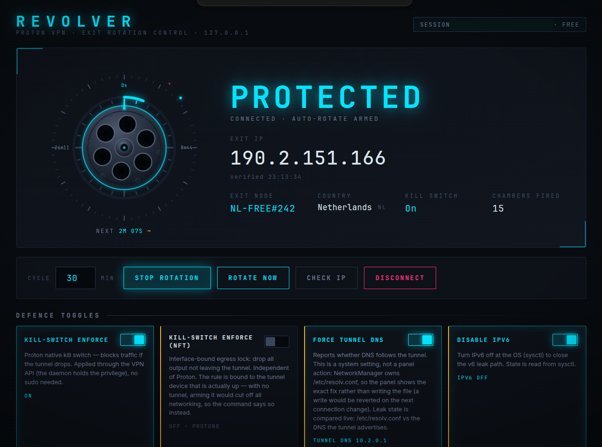

# REVOLVER — Proton VPN exit-rotation control, a local honest defence dashboard



## What it is

A cyberpunk-themed web GUI over a local ProtonVPN exit-rotator. Runs on
`127.0.0.1:8737` and auto-rotates the Proton exit node on a timer.

## Design principle — every control is honest

No fake security lights. Each toggle reports real system state, and privileged
actions surface the exact command rather than embedding a password.

## Features

- **Auto-rotation** on a configurable cycle (default 30 min) with manual
  **Rotate Now** / **Stop** / **Check IP** / **Disconnect**.
- **Live status**: connection, verified exit IP, exit node + country,
  kill-switch state, countdown.
- **Defence toggles**:
  - **Kill-Switch Enforce** — Proton native, via VPN API, no sudo.
  - **Kill-Switch Enforce (NFT)** — interface-bound egress lock, independent of Proton.
  - **Force Tunnel DNS** — detect-only, compares `/etc/resolv.conf` vs tunnel-advertised DNS.
  - **Disable IPv6** — sysctl.
- **Revolver-cylinder logo** with idle spin + 60° snap per rotation and a countdown ring.

## Run

```
python3 app.py
```

Then open http://127.0.0.1:8737

Requires an existing ProtonVPN session; the app reuses your logged-in Proton
session and never stores your password.

## Status

Personal project, v1.0.
